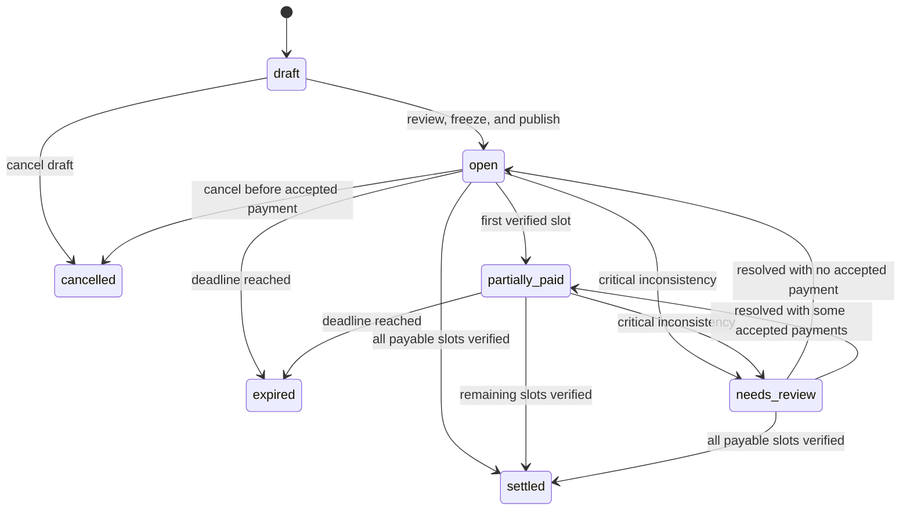
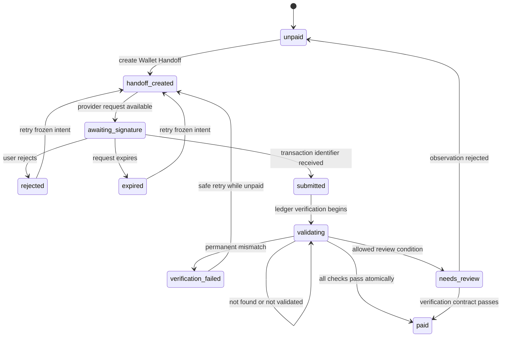

# XRPL Group Pay — State Machines

**Status:** Active  
**Scope:** Current XRP states with approved wallet- and asset-aware amendments  
**Last reviewed:** 2026-06-24  
**Document class:** Public

## 1. Principles

- State transitions are server-authoritative.
- Client navigation and Wallet Provider status do not prove payment.
- Paid and settled transitions are monotonic.
- Every accepted transition is auditable.
- The state model is provider-neutral even where current storage retains legacy Xaman field names.
- Asset-specific verification is selected from the frozen Payment Intent.

## 2. Bill state

```text
draft
open
partially_paid
settled
expired
cancelled
needs_review
```



Bill invariants:

- `draft` is editable and browser-local in the current creation flow;
- payment-critical fields are frozen at `open`;
- Settlement Asset cannot change after publication;
- `settled` requires every payable slot to have an accepted receipt;
- cancellation or expiry cannot erase validated transactions.

## 3. PaymentSlot state

```text
unpaid
handoff_created
awaiting_signature
rejected
expired
submitted
validating
paid
verification_failed
needs_review
```

Current database or UI names such as `payload_created` remain compatibility aliases until a migration explicitly replaces them.



PaymentSlot invariants:

- one active handoff is preferred per slot;
- retry preserves frozen Payment Intent and Bill revision;
- `paid` has one accepted receipt and transaction identifier;
- `paid` cannot return to `unpaid`;
- duplicate transaction use cannot pay another slot;
- provider metadata cannot alter payment conditions.

## 4. Wallet Handoff state

```text
created
available
opened
resolved_unsigned
resolved_signed
submitted
expired
failed
```

Xaman payload lifecycle is the first implementation of this state model.

A signed or submitted handoff still does not map directly to `PaymentSlot.paid`.

## 5. Asset readiness state

```text
unknown
checking
ready
blocked_missing_account
blocked_missing_trust_line
blocked_limit
blocked_asset_state
unavailable
```

For XRP, readiness is normally implicit after address validation. For RLUSD, recipient readiness is checked before Bill freeze.

Readiness is preflight information and cannot replace ledger verification.

## 6. Transaction observation state

```text
received
not_found
unvalidated
validated_success
validated_failure
mismatch
duplicate
```

A validated-success observation means only that XRPL reported `tesSUCCESS`. The slot is satisfied only after the asset-specific verification contract passes.

## 7. Verification result

```text
VERIFIED
RETRY_NOT_FOUND
RETRY_UNVALIDATED
FAIL_VALIDATED_RESULT
FAIL_WRONG_TRANSACTION_TYPE
FAIL_WRONG_NETWORK
FAIL_WRONG_SENDER
FAIL_WRONG_DESTINATION
FAIL_WRONG_DESTINATION_TAG
FAIL_WRONG_SOURCE_TAG
FAIL_WRONG_INVOICE_ID
FAIL_WRONG_ASSET
FAIL_WRONG_CURRENCY
FAIL_WRONG_ISSUER
FAIL_WRONG_AMOUNT
FAIL_PARTIAL_PAYMENT
FAIL_UNSUPPORTED_PATH
FAIL_DUPLICATE_TRANSACTION
FAIL_SLOT_ALREADY_PAID
FAIL_MALFORMED_RESPONSE
REVIEW_ALTERNATIVE_PAYER
```

## 8. Bill recomputation

```text
if critical review condition:
    bill = needs_review
else if every payable slot = paid:
    bill = settled
else if at least one payable slot = paid:
    bill = partially_paid
else if deadline passed:
    bill = expired
else:
    bill = open
```

Progress uses Accounting Currency. Make Waves v1 keeps Accounting Currency equal to Settlement Asset.

## 9. Future Settlement Quote state

```text
draft
active
expired
replaced
accepted
consumed
cancelled
```

A replaced or expired quote cannot remain signable. A changed quote requires a new participant confirmation and new Wallet Handoff.

## 10. Idempotent events

Event key examples:

```text
wallet:{provider_id}:{request_id}:{state}
xrpl:{network}:{transaction_id}
slot-verification:{slot_id}:{transaction_id}
readiness:{asset_id}:{destination}:{observation}
quote:{quote_id}:{revision}:{state}
```

Repeated processing returns the existing normalized result, avoids duplicate metrics and audit entries, and preserves original accepted timestamps.

## 11. Audit events

```text
BILL_CREATED
BILL_REVIEWED
BILL_PUBLISHED
BILL_EXPIRED
BILL_CANCELLED
SLOT_CREATED
ASSET_READINESS_CHECKED
HANDOFF_CREATED
HANDOFF_REJECTED
HANDOFF_EXPIRED
TRANSACTION_REPORTED
TRANSACTION_NOT_FOUND
TRANSACTION_VALIDATED
TRANSACTION_REJECTED
RECEIPT_ACCEPTED
SLOT_PAID
SLOT_REVIEW_REQUIRED
BILL_PARTIALLY_PAID
BILL_SETTLED
CAPABILITY_REVOKED
QUOTE_CREATED
QUOTE_REPLACED
QUOTE_EXPIRED
```

Audit events do not include complete private shared links or provider server configuration.
