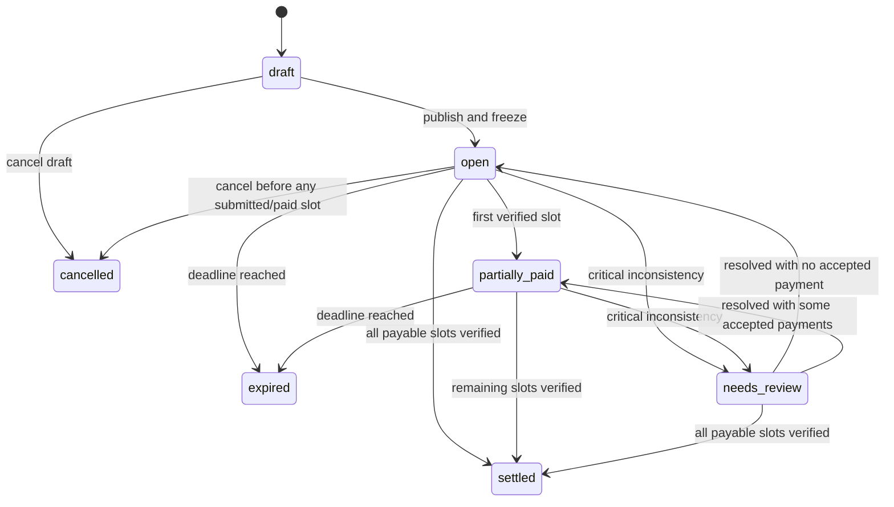
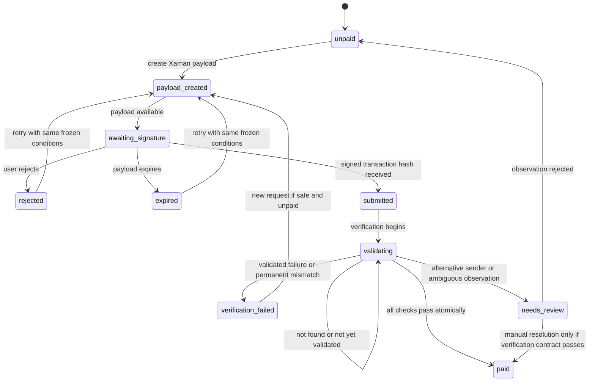
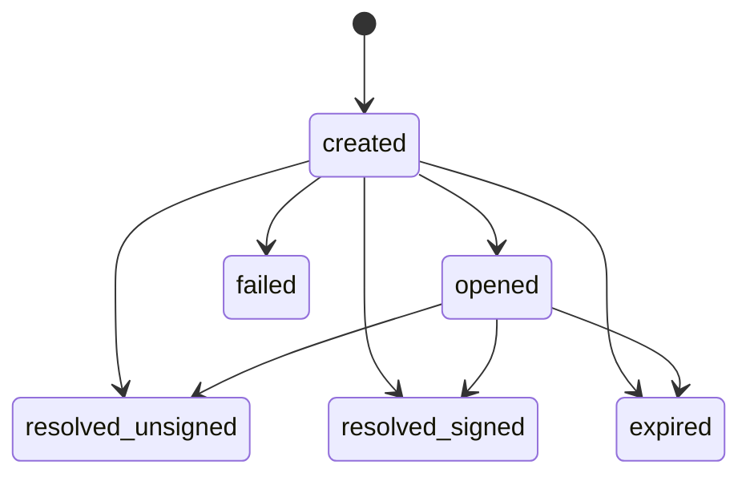
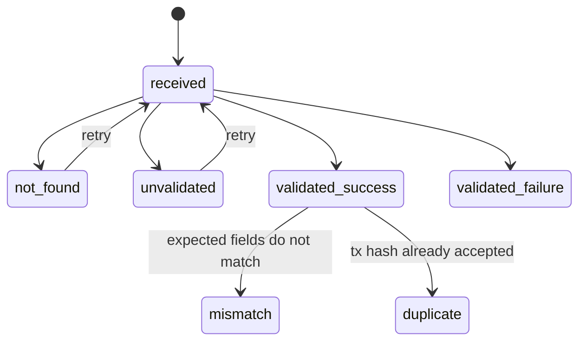

# XRPL Group Pay — State Machines

**Status:** Draft for PR 1  
**Document class:** Public

## 1. Principles

- State transitions are server-authoritative.
- Client navigation does not prove a transition.
- Webhooks request verification; they do not directly prove payment.
- Paid and settled transitions are monotonic unless an explicit security incident procedure marks records for review.
- All transitions are auditable.

## 2. Bill state

```text
draft
open
partially_paid
settled
expired
cancelled
needs_review
```

### 2.1 Bill transitions



### 2.2 Bill invariants

- `draft` is editable.
- Payment-critical fields are frozen at `open`.
- `settled` requires every payable slot to be paid.
- `cancelled` cannot erase validated transactions.
- A bill with a paid slot cannot be represented as if no payment occurred.
- `expired` does not silently accept a late payment; late-payment policy must be explicit.

## 3. Payment-slot state

```text
unpaid
payload_created
awaiting_signature
rejected
expired
submitted
validating
paid
verification_failed
needs_review
```

### 3.1 Payment-slot transitions



### 3.2 Payment-slot invariants

- Only one active Xaman payload is preferred per slot.
- A retry preserves destination, amount, InvoiceID, Source Tag, and network.
- `paid` has exactly one accepted transaction hash.
- `paid` cannot return to `unpaid`.
- A different sender never becomes paid without the defined review path.
- A duplicate transaction cannot pay a second slot.

## 4. Xaman payload state

```text
created
opened
resolved_unsigned
resolved_signed
expired
failed
```



Interpretation:

- `resolved_unsigned`: rejected or closed without signing.
- `resolved_signed`: a transaction hash is expected, but payment is not yet verified.
- `failed`: payload creation or retrieval failure.

A payload state is never mapped directly to `payment_slot.paid`.

## 5. Transaction observation state

```text
received
not_found
unvalidated
validated_success
validated_failure
mismatch
duplicate
```



A `validated_success` observation means only that XRPL reported `tesSUCCESS`. It does not mean the Group Pay slot is satisfied until all expected-field checks pass.

## 6. Verification result

Structured terminal or retryable results:

```text
VERIFIED
RETRY_NOT_FOUND
RETRY_UNVALIDATED
FAIL_VALIDATED_RESULT
FAIL_WRONG_TRANSACTION_TYPE
FAIL_WRONG_NETWORK
FAIL_WRONG_SENDER
FAIL_WRONG_DESTINATION
FAIL_WRONG_DESTINATION_TAG
FAIL_WRONG_SOURCE_TAG
FAIL_WRONG_INVOICE_ID
FAIL_WRONG_ASSET
FAIL_WRONG_AMOUNT
FAIL_PARTIAL_PAYMENT
FAIL_DUPLICATE_TRANSACTION
FAIL_SLOT_ALREADY_PAID
FAIL_MALFORMED_RESPONSE
REVIEW_ALTERNATIVE_PAYER
```

## 7. Bill recomputation

After any slot transition:

```text
if critical review condition:
    bill = needs_review
else if every payable slot = paid:
    bill = settled
else if at least one payable slot = paid:
    bill = partially_paid
else if deadline passed:
    bill = expired
else:
    bill = open
```

Draft and cancelled states are handled separately and are not overwritten by routine recomputation.

## 8. Idempotent event processing

Event key examples:

```text
xaman:{payload_uuid}:{resolution_state}
xrpl:{network}:{tx_hash}
slot-verification:{slot_id}:{tx_hash}
```

Repeated receipt must:

- Return the existing normalized result.
- Avoid duplicate metrics.
- Avoid duplicate activity entries.
- Avoid a second bill-state notification.
- Preserve the original accepted timestamp where appropriate.

## 9. Audit events

Proposed append-only normalized audit types:

```text
BILL_CREATED
BILL_PUBLISHED
BILL_EXPIRED
BILL_CANCELLED
SLOT_CREATED
PAYLOAD_CREATED
PAYLOAD_REJECTED
PAYLOAD_EXPIRED
TRANSACTION_REPORTED
TRANSACTION_NOT_FOUND
TRANSACTION_VALIDATED
TRANSACTION_REJECTED
SLOT_PAID
SLOT_REVIEW_REQUIRED
BILL_PARTIALLY_PAID
BILL_SETTLED
CAPABILITY_REVOKED
```

Audit events must not include raw capability tokens or secrets.
