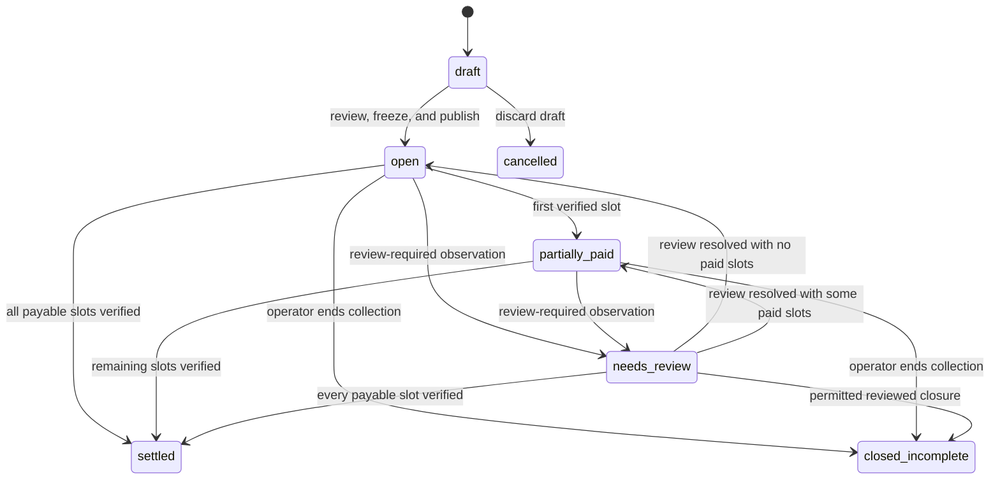
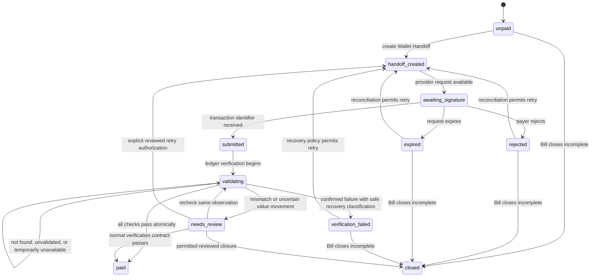

# XRPL Group Pay — State Machines

**Status:** Active  
**Scope:** Approved role-aware, asset-aware, provider-neutral payment lifecycle  
**Last reviewed:** 2026-07-01  
**Document class:** Public

## 1. Principles

- State transitions are server-authoritative.
- Client navigation and Wallet Provider status do not prove payment.
- Paid and settled transitions are monotonic.
- Every accepted transition is auditable.
- The state model is provider-neutral even where current storage retains legacy Xaman field names.
- Asset-specific verification is selected from the frozen Payment Intent.
- Each PaymentSlot settles independently from every other slot.
- One payer failure never reverses another payer's accepted receipt.
- Uncertain or mismatched value movement never creates an automatic replacement Payment.
- A closed-incomplete Bill preserves every verified receipt and blocks new handoffs.

## 2. Role and mode state

A Bill freezes one payment mode:

```text
representative
direct
```

- `representative` permits a recipient-funded amount for which no transfer occurs.
- `direct` requires the full Bill total to be assigned to payer slots.

Bill operator, recipient, and payer are distinct roles. A single person may hold multiple roles, but state transitions do not infer that relationship.

## 3. Bill state

Canonical revision states:

```text
draft
open
partially_paid
needs_review
settled
closed_incomplete
```

Compatibility states may remain for historical data:

```text
expired
cancelled
```

No automatic Bill deadline is introduced by this revision.


```mermaid
stateDiagram-v2
  [*] --> draft
  draft --> open: review, freeze, and publish
  draft --> cancelled: discard draft
  open --> partially_paid: first verified slot
  open --> settled: all payable slots verified
  partially_paid --> settled: remaining slots verified
  open --> needs_review: review-required observation
  partially_paid --> needs_review: review-required observation
  needs_review --> open: review resolved with no paid slots
  needs_review --> partially_paid: review resolved with some paid slots
  needs_review --> settled: every payable slot verified
  open --> closed_incomplete: operator ends collection
  partially_paid --> closed_incomplete: operator ends collection
  needs_review --> closed_incomplete: permitted reviewed closure
```

Bill invariants:

- `draft` is editable and browser-local in the approved creation flow;
- payment-critical fields are frozen at `open`;
- payment mode, recipient, network, Settlement Asset, payer, amount, tags, and InvoiceID cannot change after publication;
- `settled` requires every payable slot to have an accepted receipt;
- `closed_incomplete` preserves accepted receipts and prevents new Wallet Handoffs;
- cancellation, historical expiry, or incomplete closure cannot erase validated transactions;
- `needs_review` is not a global failure and does not reverse paid slots.

## 4. Public Bill status mapping

| Public status | Internal condition |
|---|---|
| Accepting payments | `open` with no paid slots |
| Partially paid | `partially_paid` |
| Needs review | `needs_review` |
| All paid | `settled` |
| Closed incomplete | `closed_incomplete` |

The interface does not use a global “Group payment failed” state.

## 5. Bill recomputation

```text
if bill = closed_incomplete:
    preserve closed_incomplete
else if any payable slot = needs_review:
    bill = needs_review
else if every payable slot = paid:
    bill = settled
else if at least one payable slot = paid:
    bill = partially_paid
else:
    bill = open
```

Progress uses Accounting Currency. Make Waves v1 keeps Accounting Currency equal to Settlement Asset.

## 6. PaymentSlot state

```text
unpaid
handoff_created
awaiting_signature
rejected
expired
submitted
validating
paid
verification_failed
needs_review
closed
```

Current database or UI names such as `payload_created` remain compatibility aliases until a migration explicitly replaces them.


```mermaid
stateDiagram-v2
  [*] --> unpaid
  unpaid --> handoff_created: create Wallet Handoff
  handoff_created --> awaiting_signature: provider request available
  awaiting_signature --> rejected: payer rejects
  awaiting_signature --> expired: request expires
  awaiting_signature --> submitted: transaction identifier received
  submitted --> validating: ledger verification begins
  validating --> validating: not found, unvalidated, or temporarily unavailable
  validating --> paid: all checks pass atomically
  validating --> verification_failed: confirmed failure with safe recovery classification
  validating --> needs_review: mismatch or uncertain value movement
  rejected --> handoff_created: reconciliation permits retry
  expired --> handoff_created: reconciliation permits retry
  verification_failed --> handoff_created: recovery policy permits retry
  needs_review --> validating: recheck same observation
  needs_review --> handoff_created: explicit reviewed retry authorization
  needs_review --> paid: normal verification contract passes
  unpaid --> closed: Bill closes incomplete
  rejected --> closed: Bill closes incomplete
  expired --> closed: Bill closes incomplete
  verification_failed --> closed: Bill closes incomplete
  needs_review --> closed: permitted reviewed closure
```

PaymentSlot invariants:

- one active handoff is permitted per slot;
- retry preserves the frozen Payment Intent and Bill revision;
- `paid` has one accepted receipt and transaction identifier;
- `paid` cannot return to another state;
- duplicate transaction use cannot pay another slot;
- provider metadata cannot alter payment conditions;
- `submitted` and `validating` block a new Payment while value movement remains uncertain;
- `needs_review` is neither paid nor safely unpaid;
- `closed` cannot create a new Wallet Handoff.

## 7. Public payer status mapping

| Public status | Internal states |
|---|---|
| Unpaid | `unpaid` |
| Waiting for Xaman | `handoff_created`, `awaiting_signature` |
| Verifying on XRPL | `submitted`, `validating` |
| Paid | `paid` |
| Retry required | `rejected`, `expired`, retry-safe `verification_failed` |
| Needs review | `needs_review` |
| Closed | `closed` |

Public copy may explain the specific reason, but these stable categories drive shared badges, accessibility announcements, Guide anchors, and management actions.

## 8. Wallet Handoff state

```text
created
available
opened
rejected
expired
signed
submitted
failed
```

Xaman payload lifecycle is the first implementation of this model.

Rules:

- lifecycle state is durably recorded;
- callbacks and polling are idempotent sources of the same normalized state;
- out-of-order provider events cannot regress a later state;
- a signed or submitted handoff still does not map directly to `PaymentSlot.paid`;
- an active handoff is resumed instead of silently replaced;
- rejected or expired handoffs enter the reconciliation-gated retry path.

## 9. Asset readiness state

```text
unknown
checking
ready
blocked_missing_account
blocked_missing_trust_line
blocked_insufficient_asset
blocked_insufficient_xrp
blocked_limit
blocked_asset_state
unavailable
```

Recipient readiness is checked before an RLUSD Bill is frozen. Payer readiness is checked before a Payment handoff when supported.

Readiness is preflight information and cannot replace wallet approval or validated-ledger verification.

A transient provider or XRPL outage maps to `unavailable`, not to a confirmed missing balance or trust line.

## 10. TrustSet preparation state

```text
not_required
required
handoff_created
awaiting_signature
rejected
expired
submitted
verifying
ready
failed
```

TrustSet preparation:

- is separate from Payment settlement;
- uses only the canonical network-specific RLUSD identity;
- becomes `ready` only after XRPL confirms the trust line;
- does not transfer the Bill amount or fund the account with RLUSD.

## 11. Transaction observation state

```text
received
not_found
unvalidated
validated_success
validated_failure
mismatch
duplicate
multiple_candidates
unavailable
```

A validated-success observation means only that XRPL reported `tesSUCCESS`. The slot is satisfied only after the asset-specific verification contract passes.

## 12. Verification result

```text
VERIFIED
RETRY_NOT_FOUND
RETRY_UNVALIDATED
RETRY_UNAVAILABLE
FAIL_VALIDATED_RESULT
FAIL_WRONG_TRANSACTION_TYPE
FAIL_WRONG_NETWORK
FAIL_WRONG_SENDER
FAIL_WRONG_DESTINATION
FAIL_WRONG_DESTINATION_TAG
FAIL_WRONG_SOURCE_TAG
FAIL_WRONG_INVOICE_ID
FAIL_WRONG_ASSET
FAIL_WRONG_CURRENCY
FAIL_WRONG_ISSUER
FAIL_WRONG_AMOUNT
FAIL_PARTIAL_PAYMENT
FAIL_UNSUPPORTED_PATH
FAIL_DUPLICATE_TRANSACTION
FAIL_SLOT_ALREADY_PAID
FAIL_MALFORMED_RESPONSE
REVIEW_MISMATCH
REVIEW_MULTIPLE_CANDIDATES
```

Verification result and recovery policy are separate. A mismatch that may have moved value maps to review rather than automatic retry.

## 13. Recovery classification

```text
retry_safe
wait_and_recheck
setup_required
needs_review
already_paid
terminal
```

Examples:

- `retry_safe`: rejected handoff or expired handoff with no matching transaction;
- `wait_and_recheck`: submitted transaction not yet validated or temporary service failure;
- `setup_required`: missing trust line or insufficient confirmed balance;
- `needs_review`: wrong sender, amount, destination, asset, issuer, tags, InvoiceID, partial Payment, or multiple candidates;
- `already_paid`: same accepted transaction or paid slot;
- `terminal`: closed Bill or revoked capability.

## 14. Future Settlement Quote state

```text
draft
active
expired
replaced
accepted
consumed
cancelled
```

A replaced or expired quote cannot remain signable. A changed quote requires a new payer confirmation and new Wallet Handoff.

## 15. Idempotent events

Event key examples:

```text
wallet:{provider_id}:{request_id}:{state}
xrpl:{network}:{transaction_id}
slot-verification:{slot_id}:{transaction_id}
readiness:{asset_id}:{account}:{observation}
trustset:{network}:{account}:{asset_id}:{request_id}:{state}
bill-closure:{bill_id}:{revision}
quote:{quote_id}:{revision}:{state}
```

Repeated processing returns the existing normalized result, avoids duplicate metrics and audit entries, and preserves original accepted timestamps.

## 16. Audit events

```text
BILL_CREATED
BILL_REVIEWED
BILL_PUBLISHED
BILL_CLOSED_INCOMPLETE
BILL_CANCELLED
SLOT_CREATED
SLOT_CLOSED
ASSET_READINESS_CHECKED
TRUSTSET_HANDOFF_CREATED
TRUSTSET_VERIFIED
HANDOFF_CREATED
HANDOFF_REJECTED
HANDOFF_EXPIRED
HANDOFF_RESUMED
TRANSACTION_REPORTED
TRANSACTION_NOT_FOUND
TRANSACTION_VALIDATED
TRANSACTION_REJECTED
RECEIPT_ACCEPTED
SLOT_PAID
SLOT_REVIEW_REQUIRED
SLOT_RETRY_AUTHORIZED
BILL_PARTIALLY_PAID
BILL_REVIEW_REQUIRED
BILL_SETTLED
CAPABILITY_REVOKED
BILL_COPIED_TO_DRAFT
QUOTE_CREATED
QUOTE_REPLACED
QUOTE_EXPIRED
```

Audit events do not include complete private shared links, capability values, provider server configuration, or unnecessary payer metadata.
